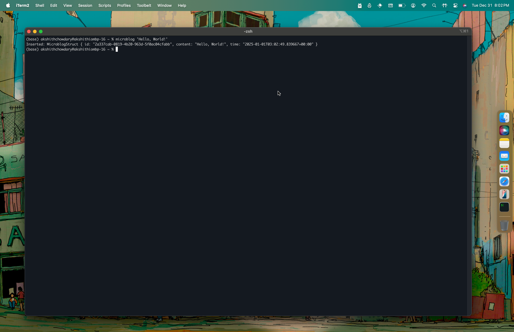

# microblog - [akshith.io](https://akshith.io)

♻️ archived in favor of [adot](https://github.com/akshithio/adot)

***
🔨: You can run it by simply cloning, running `cargo build` followed by `cargo run -- "content to microblog"`. Built in Rust.
***

This is a simple microblogging tool that I built in Rust. It takes a string as an argument and sends it to a firestore database with a UUID and the current UTC timestamp. I intend to use this tool and the firestore database, in the future, for my currently 🚧WIP🚧 personal website.  It's a simple tool that I built to get more familiar with Rust and CLI tools.

In its current configuration, The path to the JSON file that contains the credentials for the firestore database, alongside the project name are hardcoded into my local `.zshrc` file, for the lack of a better solution.

 

&nbsp;   small lil thingamajig? - akshithio - dec 2024 
